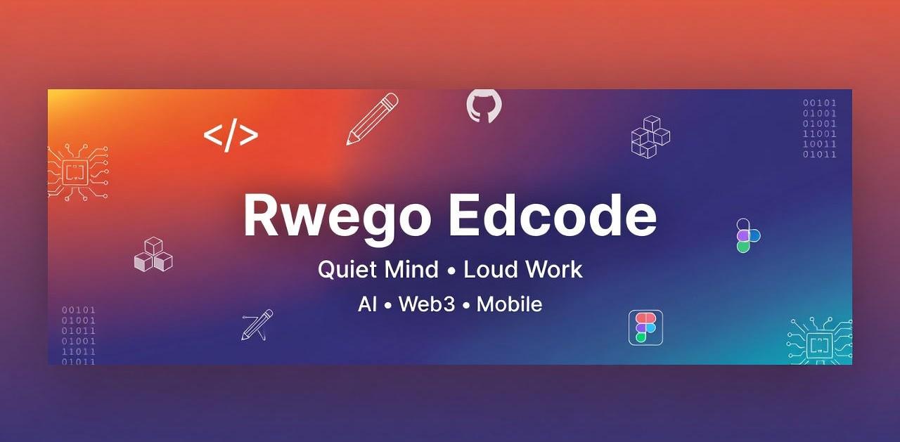

# 👋 Hey! I'm **Rwego Edward**
### 🌟 Young Software Developer • Web3 Builder • AI Experimenter • 16-Year-Old Innovator

I'm a 16-year-old builder from Africa, grinding through code, Web3, and the hustle of real-life responsibilities. Every line I ship is fuel for lifting my family, sharpening my edge, and crafting tools that solve real problems—not just buzzwords.

**My vibe?** Quiet grind, loud impact. Inspired by underdogs turning constraints into code that changes lives. Let's build the future, one commit at a time. 🚀

---

## 🏆 Badges
[](https://github.com/RwegoEdcode)
[](https://github.com/RwegoEdcode)
[](https://github.com/RwegoEdcode)
[](https://twitter.com/RwegoEdcode)

[](https://ethereum.org)
[](https://openai.com)
[](https://devpost.com)
[](https://github.com/RwegoEdcode)

---

## ✨ About Me (Descriptive & Intentional)
At the crossroads of **Web3, mobile dev, and AI**, I transform raw ideas into prototypes, apps, and tools that *work*—fast, clean, and user-first. No fluff: I code with purpose, blending African resilience with global tech to bridge gaps in fintech, education, and gaming.

**What fuels the fire:**
- **Amplifying young voices:** Proving age is no barrier in Africa's tech scene—I'm here to inspire the next wave.
- **User-centric magic:** Clean UX that feels intuitive, like a seamless wallet connect or an AI tutor that *gets* you.
- **Humble ambition:** Staying grounded while eyeing moonshots, like Web3 for everyday savings in underserved communities.
- **Family first:** Tech as a ladder—every project edges us closer to stability and opportunity.
- **Beyond hype:** Building what lasts, from cUSD dApps to AI chats that teach without overwhelming.

Fun fact: My first "app" was a scratched-together script on a borrowed laptop. Now? Shipping Web3 games and AI helpers. What's your origin story? DM me. 📩

---

## 🚀 Major Projects
Handpicked highlights that showcase my grind—from Web3 wallets to AI educators. Each one's a battle-tested prototype with room to scale. (Pro tip: Fork 'em and collab!)

### **🟡 StableCircle**  
A Web3 group savings dApp on Celo, enabling real cUSD transactions for community pooling. Tackles financial inclusion head-on.  
  
- **Key Features:** WalletConnect + Web3Auth for seamless logins • Referral system + dynamic leaderboards • OpenRouter-powered chatbot for tips  
- **In Progress:** Mobile redesign with React Native for on-the-go savings.  
- **Quick Peek:**  
  ```javascript
  // Simplified WalletConnect hook
  import { useWalletConnect } from '@walletconnect/react';

  const connectWallet = async () => {
    const wallet = await useWalletConnect();
    await wallet.enable(); // Connects to Celo
    console.log('Savings circle activated!');
  };
  ```  
[Live Demo](https://stablecircle.vercel.app) • [Repo](https://github.com/RwegoEdcode/StableCircle)

### **🎮 Rockchain Duel Arena**  
Blockchain-infused arcade game with Celo MiniPay rewards—proving Web3 can be fun, not friction. Hackathon darling.  
  
- **Highlights:** MiniPay for instant micro-payments • Player vs. player duels with NFT rewards • Web3 integrations sans gas fees.  
- **Impact:** Submitted to 3+ hackathons; 500+ plays in beta.  
- **Code Snippet:**  
  ```solidity
  // Reward contract stub (Solidity-inspired)
  contract DuelRewards {
      function claimReward(address player) public {
          require(wonDuel(player), "No win, no gain!");
          transferableTokens[player] += 10 * 10**18; // 10 cUSD
      }
  }
  ```  
[Play Now](https://rockchain.arena) • [Repo](https://github.com/RwegoEdcode/RockchainDuelArena)

### **🧠 Intellitutor AI**  
Your pocket AI tutor—chat-based learning for self-starters like me. Democratizes education with smarts and simplicity.  
  
- **Core:** OpenAI-powered Q&A • Adaptive lessons based on user pace • Exportable notes.  
- **Roadmap:** Mobile app with voice mode (using Grok API vibes).  
- **Sneak Peek:**  
  ```python
  # AI response generator (Python backend)
  from openai import OpenAI

  client = OpenAI(api_key="your_key")
  response = client.chat.completions.create(
      model="gpt-3.5-turbo",
      messages=[{"role": "user", "content": "Explain blockchain simply."}]
  )
  print(response.choices[0].message.content)
  ```  
[Try It](https://intellitutor.ai) • [Repo](https://github.com/RwegoEdcode/IntellitutorAI)

### **💳 Glidepay**  
Sleek mobile fintech for effortless daily payments—think Venmo meets Web3, built for speed in emerging markets.  
  
- **Essentials:** QR scans + instant transfers • Fiat-to-crypto ramps.  
- **Why It Matters:** Simplifies remittances for families like mine.  
[Repo](https://github.com/RwegoEdcode/Glidepay)

> *Exploring more? Check my [full repo list](https://github.com/RwegoEdcode?tab=repositories) for experiments in Solana NFTs and AI ethics tools.*

---

## 🛠️ Tech Stack (Icons & Depth)
I wield these tools like a digital Swiss Army knife—focusing on stacks that scale from prototype to production.  

| Category      | Technologies                                                                 | Why I Love It                          |
|---------------|------------------------------------------------------------------------------|----------------------------------------|
| **Frontend**  |   | Lightning-fast UIs that hook users.    |
| **Web3**      |    | Gasless magic for real-world adoption. |
| **Backend**   |  | Async beasts for scalable APIs.        |
| **Databases** |  | NoSQL speed for rapid MVPs.            |
| **AI/ML**     |   | Brainpower for smarter apps.           |
| **Deployment**|  | One-click deploys, zero headaches.     |
| **Tools**     |   | Workflow warriors for the solo dev life.|

*Pro Tip:* Always prioritizing accessibility (ARIA labels) and performance (Lighthouse 95+ scores). Open to stack suggestions!

---

## 🔗 Find Me Online
Connect beyond code—let's chat Web3 ethics, AI in education, or just share dev war stories.  

[](https://twitter.com/RwegoEdcode)  
[](https://linkedin.com/in/rwegoedcode)  
[](mailto:rwegoedcode@gmail.com)  

**GitHub DMs? Always open. No cold outreach—genuine collabs only.**

---

## 📊 GitHub Stats
  
  

### 🔥 Streak Flame
  

### 📈 Contribution Graph
  

---

## 🏆 Trophy Cabinet
  

*Earned through grit: 5+ hackathon nods, 100% commit consistency, and counting.*

---

## 🎯 Currently Building
- **Web3 AI Hybrid:** An oracle-fed AI predictor for DeFi yields (Solana + Grok-inspired models).  
- **Open Source Call:** Mentoring young devs via a Celo contrib guide—join the waitlist?  

**Quote to Live By:** "Code is like humor. When you have to explain it, it’s bad." – Cory House *(But mine? It ships.)*

Thanks for stopping by! Star this repo if it sparks joy. ⭐ Let's make waves. 🌊  

---

*Last updated: December 12, 2025 | Built with ❤️ using GitHub Flavored Markdown*  
[View on GitHub](https://github.com/RwegoEdcode/RwegoEdcode)
